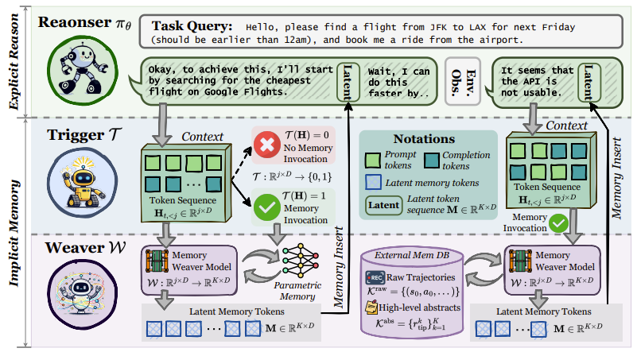

# MemGen: Weaving Generative Latent Memory for Self-Evolving Agents

## 👋 Introduction
This repo is the official implementation of [***MemGen: Weaving Generative Latent Memory for Self-Evolving Agents***]()

Inspired by the human brain’s ability to dynamically integrate memory and reasoning, MemGen introduces a novel framework that empowers AI agents to evolve through experience—without relying on rigid parameter updates or external databases.

Unlike traditional approaches, MemGen generates latent memory tokens directly within the model’s reasoning stream. It features:
- A Memory Trigger that decides when to recall memory.
- A Memory Weaver that synthesizes past experiences into compact, latent sequences—seamlessly enriching ongoing reasoning.



## 🌎 Setup

Create and activate the MemGen environment from the provided YAML file:

```
conda env create -f memgen.yaml
conda activate MemGen
```

## 🚀 Quick Start

### 🔧 Installation: Set Up Search Environment
Please follow the instructions in the [Search-R1](https://github.com/PeterGriffinJin/Search-R1?tab=readme-ov-file#retriever-environment-optional) to configure the retriever environment (optional).

---

### ▶️ How to Run
MemGen consists of **two modules**: *Weaver* and *Trigger*.  
We follow a two-stage training approach, training each module separately.

#### Weaver Model
- **Train the Weaver model**
    ```bash
    bash weaver_train.sh
    ```

- **Evaluate the Weaver model**  
    Before running, make sure to update `LOAD_MODEL_PATH` in `eval.sh` to point to the trained checkpoint: `<weaver_dir>/model.safetensors`
    ```bash
    bash eval.sh
    ```

#### Trigger Model
- **Train the Trigger model**
    ```bash
    bash trigger_train.sh
    ```
- **Evaluate the Trigger model**  
    Before running, make sure to update `LOAD_MODEL_PATH` in `eval.sh` to point to the trained checkpoint: `<trigger_dir>/model.safetensors`
    ```bash
    bash eval.sh
    ```

## 🫡 Citation
If you find this repository helpful, a citation to our paper would be greatly appreciated:
```
```

## 🙏 Acknowledgement
- We sincerely thank [Search-R1](https://github.com/PeterGriffinJin/Search-R1) for open-sourcing their search web environment.
- We also extend our heartfelt thanks to [LAVIS](https://github.com/salesforce/LAVIS) for their code framework design.